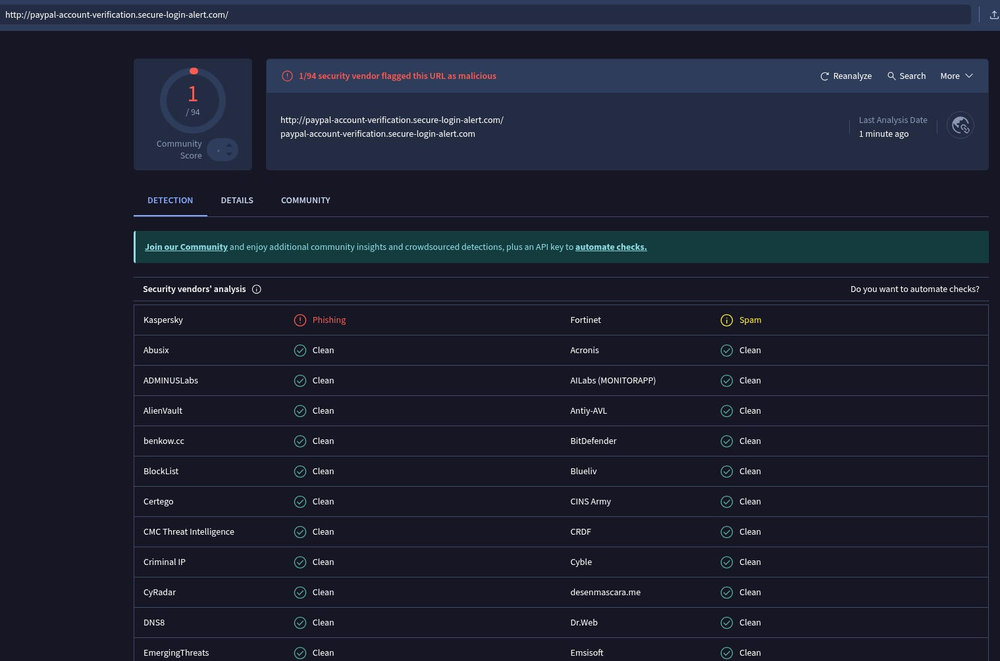

# Task 02 – Phishing Detection & Awareness Report

## Objective
To analyze a suspicious email and identify phishing indicators, attack techniques, and prevention strategies.

---

## 1. Phishing Email Sample
Subject: URGENT: Account Suspension Notice – Immediate Action Required

From: security@paypaI-support.com
To: user@example.com
Date: March 25, 2026

Dear Valued Customer,

We detected unusual activity on your PayPal account. For your protection, your account has been temporarily suspended.

To restore access immediately, please verify your account information by clicking the secure link below:

http://paypal-account-verification.secure-login-alert.com

Failure to verify your account within 24 hours will result in permanent account closure.

Thank you for choosing PayPal.

Sincerely,
PayPal Security Team

---

## 2. Identified Phishing Indicators

1. Spoofed Sender Address  
   The sender email uses "paypaI-support.com" where the letter "l" in PayPal is replaced with a capital "I". This is a common homograph attack technique used to deceive users.

2. Suspicious Domain Name  
   The link provided (paypal-account-verification.secure-login-alert.com) is not an official PayPal domain. Legitimate PayPal emails only use domains ending in paypal.com.

3. Urgency & Threat Language  
   The email creates pressure by stating the account will be permanently closed within 24 hours. Phishing emails often use urgency to force victims into acting quickly.

4. Generic Greeting  
   The message uses "Dear Valued Customer" instead of the recipient’s actual name, which is typical of mass phishing campaigns.

5. HTTP Instead of HTTPS  
   The link uses HTTP instead of secure HTTPS, indicating lack of encryption and potential malicious intent.

---

## 3. Technical Analysis (Header & Link Inspection)

Link Inspection:

The provided URL:
http://paypal-account-verification.secure-login-alert.com

Analysis:
- The primary domain is "secure-login-alert.com"
- "paypal-account-verification" is only a subdomain
- Attackers use subdomains to trick users into believing the site belongs to a legitimate company.

This structure indicates a phishing attempt designed to capture login credentials.

---
## 4. Risk Assessment

Threat Type: Credential Harvesting Attack

Potential Impact:
- Unauthorized access to user accounts
- Financial loss
- Identity theft
- Data compromise

Likelihood:
High — The use of urgency, spoofed domains, and social engineering increases the probability of user interaction.

Overall Risk Level:
High

## 5. Awareness & Prevention Recommendations

1. Always verify sender email addresses carefully.
2. Hover over links before clicking to inspect the real destination.
3. Avoid clicking urgent security links directly from emails.
4. Access financial services by manually typing the official domain (e.g., paypal.com).
5. Enable Multi-Factor Authentication (MFA) on all sensitive accounts.
6. Report suspicious emails to the organization’s security team.
7. Implement employee phishing awareness training programs.

---

---

## 6. Evidence

### VirusTotal URL Scan

